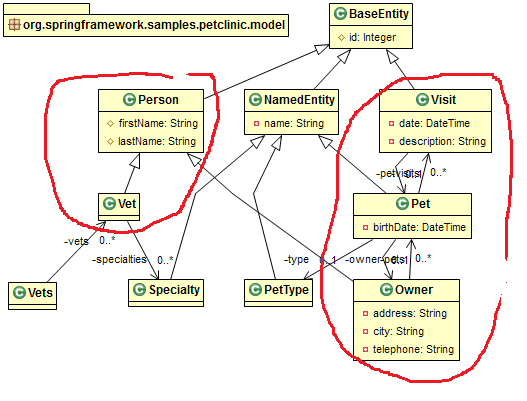

## business domain model

- is words in conversation between client, PO, architect 
- should be plain objects (POJO) 
- when communicating inside team should have picture
- when communicating with PO, business people _must_ use picture

- Model is not database structure! (e.g. it may be in RDBMS or NoSQL) 