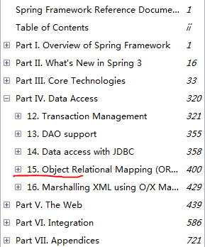

From Spring Framework Reference Documentation
3.2.3.RELEASE

    15. Object Relational Mapping (ORM) Data Access  
    15.1 Introduction to ORM with Spring  
> The Spring Framework supports integration with Hibernate, Java Persistence API (JPA), Java
Data Objects (JDO) and iBATIS SQL Maps for resource management, data access object (DAO)
implementations, and transaction strategies. For example, for Hibernate there is first-class support
with several convenient IoC features that address many typical Hibernate integration issues. You can
configure all of the supported features for O/R (object relational) mapping tools through Dependency
Injection. They can participate in Spring's resource and transaction management, and they comply
with Spring's generic transaction and DAO exception hierarchies. The recommended integration style
is to code DAOs against plain Hibernate, JPA, and JDO APIs.

that is support for:

- Hibernate
- Java Persistence API (JPA)
- Java Data Objects (JDO)
- iBATIS 2.x SQL Maps 