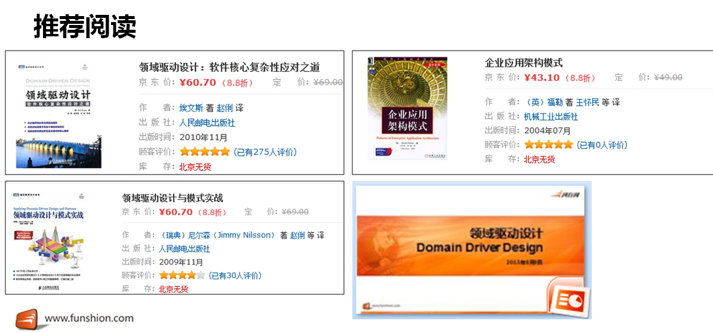
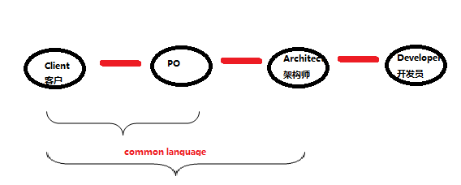
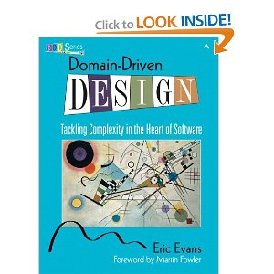
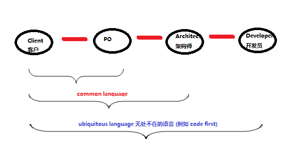

## Domain-driven design

<http://en.wikipedia.org/wiki/Domain_driven_design>

Domain-Driven Design: Tackling Complexity in the Heart of Software by Eric Evans (2003)  

Related to OOD [Object-oriented design](http://en.wikipedia.org/wiki/Object_oriented_design) 面向对象设计:

- Conceptual model 概念模型
- Use case, scenarios 用例

The Principles of OOD (SOLID)
http://butunclebob.com/ArticleS.UncleBob.PrinciplesOfOod

DDD Core definitions

- Domain: A sphere of knowledge, influence, or activity. The subject area to which the user applies a program is the domain of the software.
- Model: A system of abstractions that describes selected aspects of a domain and can be used to solve problems related to that domain.
- Ubiquitous Language: A language structured around the domain model and used by all team members to connect all the activities of the team with the software.
- Context: The setting in which a word or statement appears that determines its meaning.

Domain objects:

- Entity: An object that is not defined by its attributes, but rather by a thread of continuity and its identity.
- Value Object: An object that contains attributes but has no conceptual identity. They should be treated as immutable.

- Service: When an operation does not conceptually belong to any object. Following the natural contours of the problem, you can implement these operations in services. See also Service (systems architecture).
- Repository: methods for retrieving domain objects should delegate to a specialized Repository object such that alternative storage implementations may be easily interchanged.
- Factory: methods for creating domain objects should delegate to a specialized Factory object such that alternative implementations may be easily interchanged.

Make class name the same as domain objects names.

compare to framework-driven-design that is anti-pattern. 

