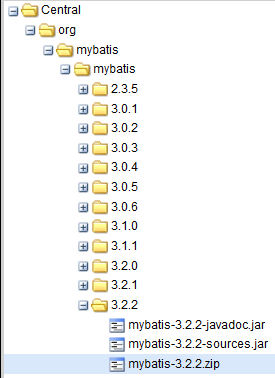
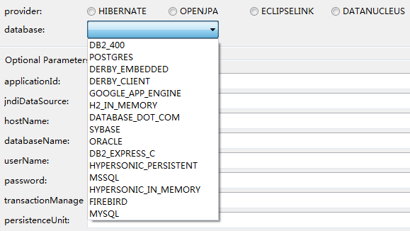

- Java persistence options (iBatis, Hibernate, JPA2, Spring Data)

# Java persistence options (iBatis, Hibernate, JPA2, Spring Data)

[Persistence (computer science)](http://en.wikipedia.org/wiki/Persistence_%28computer_science%29)

In computer science, persistence refers to the characteristic of state that outlives the process that created it. Without this capability,
 state would only exist in RAM, and would be lost when this RAM loses power, such as a computer shutdown.

Persistence = saving data

## iBatis

[iBATIS](http://en.wikipedia.org/wiki/Ibatis)

Other persistence frameworks such as Hibernate allow the creation of an object model (in Java, say) by the user, and create and maintain the relational database automatically.
 iBATIS takes the reverse approach: the developer starts with a SQL database and iBATIS automates the creation of the Java objects. Both approaches have advantages,
 and iBATIS is a good choice when the developer does not have full control over the SQL database schema. For example, an application may need to access an existing SQL database
  used by other software, or access a new database whose schema is not fully under the application developer's control, such as when a specialized database design team
  has created the schema and carefully optimized it for high performance.

http://ibatis.apache.org/

> Apache iBATIS is retired at the apache software foundation (2010/06/16) 

-> http://blog.mybatis.org/ MyBatis 3

### Distributed via Maven



	<dependency>
	  <groupId>org.mybatis</groupId>
	  <artifactId>mybatis</artifactId>
	  <version>3.2.2</version>
	  <type>zip</type>
	</dependency>
	
## Hibernate

Hibernate is ORM that makes selecting database independent.

4.2.2 / May 22, 2013 by Red Hat (JBoss)	


[Hibernate](http://en.wikipedia.org/wiki/Hibernate_%28Java%29)

Hibernate Query Language (HQL)

	@Entity
	public class Author {
	    @Id
	    private Integer id;
	    private String firstName;
	    private String lastName;
	 
	    @ManyToMany
	    private List<Book> books;
	}
	 
	@Entity
	public class Book {
	    @Id
	    private Integer id;
	    private String title;
	    private String isbn;
	 
	    @ManyToOne
	    private Publisher publisher;
	 
	    @ManyToMany
	    private List<Author> authors;
	}
	 
	@Entity
	public class Publisher {
	    @Id
	    private Integer id;
	    private String name;
	    private String address;
	 
	    @OneToMany(mappedBy = "publisher")
	    private List<Book> books;
	}
	
Simple queries to defined objects.	
	
	SELECT a FROM Author a ORDER BY a.firstName, a.lastName	

or

	SELECT DISTINCT a FROM Author a INNER JOIN a.books b WHERE b.publisher.name = 'XYZ Press'
	
JPQL is a subset of HQL.	
	
## JPA

JPA = Java Persistence API

JPA is API that makes selecting ORM independent.


JPA2/Hibernate database generation or read-oly mode

`persistence.xml`

	<?xml version="1.0" encoding="UTF-8" standalone="no"?>
	<persistence xmlns="http://java.sun.com/xml/ns/persistence" xmlns:xsi="http://www.w3.org/2001/XMLSchema-instance" version="2.0" xsi:schemaLocation="http://java.sun.com/xml/ns/persistence http://java.sun.com/xml/ns/persistence/persistence_2_0.xsd">
	<persistence-unit name="persistenceUnit" transaction-type="RESOURCE_LOCAL">
	        <provider>org.hibernate.ejb.HibernatePersistence</provider>
	        <properties>
	            <property name="hibernate.dialect" value="org.hibernate.dialect.H2Dialect"/>
	            <!-- value="create" to build a new database on each run; value="update" to modify an existing database; value="create-drop" means the same as "create" but also drops tables when Hibernate closes; value="validate" makes no changes to the database -->
	            <property name="hibernate.hbm2ddl.auto" value="create"/>
	            <property name="hibernate.ejb.naming_strategy" value="org.hibernate.cfg.ImprovedNamingStrategy"/>
	            <property name="hibernate.connection.charSet" value="UTF-8"/>
	            <!-- Uncomment the following two properties for JBoss only -->
	            <!-- property name="hibernate.validator.apply_to_ddl" value="false" /-->
	            <!-- property name="hibernate.validator.autoregister_listeners" value="false" /-->
	        </properties>
	    </persistence-unit>
	</persistence>

`property name="hibernate.hbm2ddl.auto"`  

- value="create" to build a new database on each run; 
- value="update" to modify an existing database; 
- value="create-drop" means the same as "create" but also drops tables when Hibernate closes; 
- value="validate" makes no changes to the database

	
	

- Hibernate
- OpenJPA
- EclipseLink <http://www.eclipse.org/eclipselink/jpa.php>
- DataNucleus (often with Google) <http://www.datanucleus.org/>

JPA was design to make all ORM compatible in reality, ORM can introduce feature, not available in  in other ORM.
So care must be taken if to do really ORM independent solution.

However other good side of JPA is simplifying of API.

Current is JPA 2.0.  
JPA 2.1 (JSR 338) is proposal for future JavaEE 7
 (http://en.wikibooks.org/wiki/Java_Persistence/What_is_new_in_JPA_2.1%3F , http://wiki.eclipse.org/EclipseLink/Development/JPA_2.1  )
 
 
## Spring Data 


Spring Data JPA

from Spring Data JPA - Reference Documentation (1.3.0.RELEASE)

Created by Oliver Gierke

### Intro

The key term is `Repository`. The meaning is as in ["DDD blue book" by  Eric Evans](http://en.wikipedia.org/wiki/Domain_driven_design) 

> Implementing a data access layer of an application has been cumbersome for quite a while. Too much
boilerplate code had to be written. Domain classes were anemic and not designed in a real object
oriented or domain driven manner.
> Using both of these technologies makes developers life a lot easier regarding rich domain model's
persistence. Nevertheless the amount of boilerplate code to implement repositories especially is still
quite high. So the goal of the repository abstraction of Spring Data is to reduce the effort to implement
data access layers for various persistence stores significantly.


	public interface CrudRepository<T, ID extends Serializable>
		extends Repository<T, ID> {
		❶
		<S extends T> S save(S entity);
		❷
		T findOne(ID primaryKey);
		❸
		Iterable<T> findAll();
		Long count();
		❹
		void delete(T entity);
		❺
		boolean exists(ID primaryKey);
		❻
		// ... more functionality omitted.
	}

#### Usage

1. `public interface PersonRepository extends Repository<User, Long> { ... }`
2. add `<respositories>' bean in Spring config
```
	<?xml version="1.0" encoding="UTF-8"?>
	<beans:beans xmlns:beans="http://www.springframework.org/schema/beans"
		xmlns:xsi="http://www.w3.org/2001/XMLSchema-instance"
		xmlns="http://www.springframework.org/schema/data/jpa"
		xsi:schemaLocation="http://www.springframework.org/schema/beans
		http://www.springframework.org/schema/beans/spring-beans.xsd
		http://www.springframework.org/schema/data/jpa
		http://www.springframework.org/schema/data/jpa/spring-jpa.xsd">
		
		<repositories base-package="com.acme.repositories" />
	</beans>
```
3. Inject pepository proxy into other objects (e.g. services)

	public class SomeClient {
	@Autowired
	private PersonRepository repository;
	
	public void doSomething() {
		List<Person> persons = repository.findByLastname("Matthews");
	}

## Example

Spring-petclinic

## Recommendation 

Recommendation is to use Hibernate with JPA 2. 

Using JPA 2 API let's use Spring Data JPA for some higher level data access.

