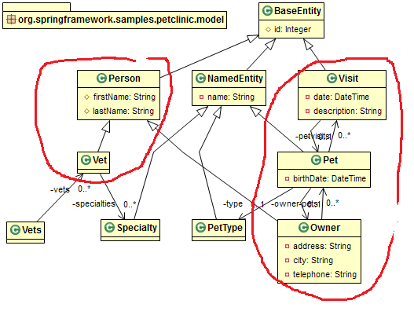
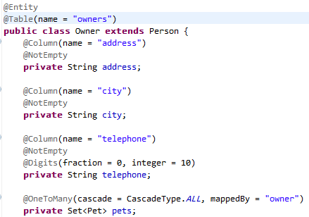

## Example Spring-petclinic

- code <https://github.com/SpringSource/spring-petclinic>
- presentation <https://speakerdeck.com/michaelisvy/spring-petclinic-sample-application>

overview  

Domain object - entity.  

Note: inclusion of ORM mapping into domain code (using annotations instead of XML binding) is violation of Layered Architecture principles (independence of layers).
However this is simpler (maintaining 1 file instead of 2; annotation don't affect code behavior, e.g. Unit test can run OK )

Repository is interface that defines access methods:

-    `Collection<Owner> findByLastName(String lastName) throws DataAccessException;`
-    `Owner findById(int id) throws DataAccessException;`
-    `void save(Owner owner) throws DataAccessException;`

JpaOwnerRepository

SpringDataOwnerRepository

`business-config.xml` defines possible configuration as `profiles`s.

